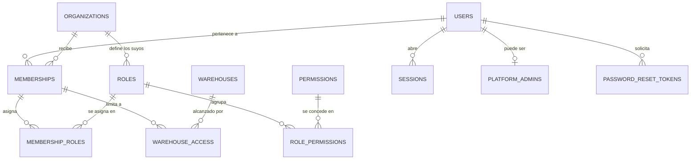
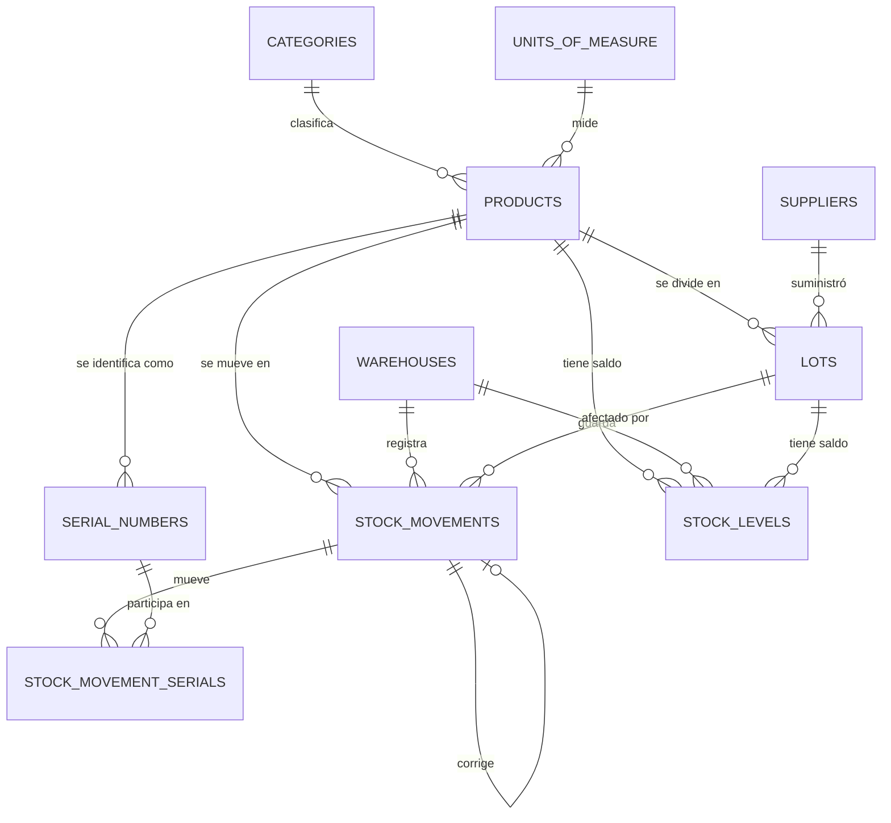
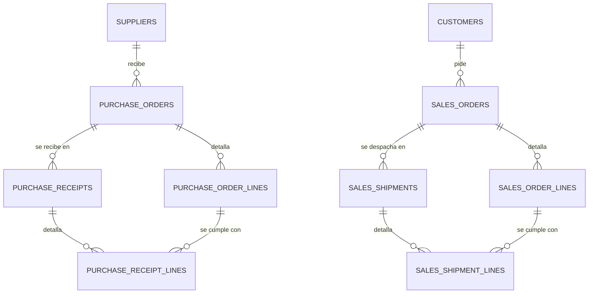

# Modelo de datos

**Audiencia:** desarrollo
**Estado:** vigente
**Responsable:** equipo de arquitectura
**Última revisión:** 2026-09-16

Qué guarda cada tabla, qué invariante defiende la base y cómo se relacionan entre sí. Al
terminar sabes dónde vive un dato, qué no puede ocurrirle y qué garantías no puedes dar por
supuestas en el código.

## 1. Qué está aquí y qué no

La fuente es [`prisma/schema.prisma`](../../prisma/schema.prisma) y las migraciones de
`prisma/migrations/`. Este documento **no** repite columna por columna: eso ya lo dice el
esquema, se genera solo y se desincronizaría en una semana.

Lo que sí está aquí es lo que el esquema no puede explicar: por qué una tabla existe, qué
regla de negocio defiende cada restricción y qué garantías viven únicamente en SQL, donde
Prisma no las ve.

Las decisiones de fondo están en los registros de decisión y no se repiten:
[0002](../adr/0002-existencias-como-libro-de-movimientos.md) para existencias,
[0003](../adr/0003-multiempresa-con-identificador-de-organizacion.md) para multiempresa,
[0005](../adr/0005-super-administrador-de-plataforma.md) para el super administrador,
[0006](../adr/0006-operacion-multipais-y-multimoneda.md) para moneda y
[0008](../adr/0008-rastreo-por-lote-y-numero-de-serie.md) para lotes y series.

## 2. Convenciones que cumple toda tabla

| Convención            | Cómo se ve                                              |
| --------------------- | ------------------------------------------------------- |
| Clave primaria        | `id` UUID v7, ordenable en el tiempo                    |
| Nombres               | `snake_case` plural, expuesto en `camelCase` con `@map` |
| Instantes             | `TIMESTAMPTZ` en tiempo universal                       |
| Fechas civiles        | `DATE`, sin zona: caducidad de lote, vigencia de tasa   |
| Importes y cantidades | `NUMERIC(18,4)`; tipos de cambio en `NUMERIC(18,8)`     |
| Multiempresa          | `organization_id`, y primero en cada índice             |
| Autoría               | `created_by_id` y `updated_by_id` en lo editable        |
| Concurrencia          | Columna `version`, para bloqueo optimista               |
| Borrado               | `deleted_at` solo en catálogos                          |

Tres excepciones deliberadas a `organization_id`: `users`, porque una persona pertenece a
varias empresas; los catálogos globales de países, monedas y permisos, que son del producto;
y las tablas de infraestructura.

Ni los movimientos de existencias ni la bitácora llevan `deleted_at`: no se borran nunca.

## 3. Identidad y control de acceso

| Tabla                   | Qué guarda                                             |
| ----------------------- | ------------------------------------------------------ |
| `users`                 | Identidad global: correo, huella de contraseña, estado |
| `organizations`         | Empresa: código, nombres, país, moneda base, zona      |
| `memberships`           | Que una persona alcanza una empresa                    |
| `roles`                 | Roles de cada empresa; los del sistema llevan `code`   |
| `permissions`           | Catálogo global `recurso:accion`, con su alcance       |
| `role_permissions`      | Qué permisos lleva un rol                              |
| `membership_roles`      | Qué roles tiene una membresía                          |
| `warehouse_access`      | Restringe una membresía a ciertos almacenes            |
| `platform_admins`       | El privilegio de plataforma, con quién y por qué       |
| `sessions`              | Sesión, con su empresa activa y su privilegio          |
| `password_reset_tokens` | Solicitudes de recuperación, con caducidad y uso       |

Lo que la base impide por sí sola:

- Dos cuentas con el mismo correo, o dos empresas con el mismo código.
- Dos empresas del mismo país con el mismo identificador fiscal.
- Dos membresías de la misma persona en la misma empresa.
- Dos roles con el mismo nombre, o el mismo código, dentro de una empresa.
- Repetir un permiso en un rol, un rol en una membresía o un almacén en un acceso.
- Dos sesiones, o dos testigos de recuperación, con la misma huella.

Dos reglas que no se ven en el diagrama y mandan sobre él:

- **El privilegio de plataforma no es una bandera.** La revocación escribe `revoked_at` en
  lugar de borrar la fila, así que el historial de quién tuvo acceso sobrevive. ADR 0005.
- **La sesión guarda la empresa activa.** Cambiarla rota la sesión, y mientras un super
  administrador actúa en una empresa ajena, `acting_as_platform_admin` lo dice en la sesión
  y en cada entrada de la bitácora. RN-072.

## 4. Catálogos globales

`countries`, `currencies` y `exchange_rates` no llevan empresa: son datos del mundo, iguales
para todos los clientes. El país aporta además lo que cambia de un sitio a otro sin
desplegar código: la etiqueta del identificador fiscal, el patrón que lo valida, el prefijo
telefónico y la zona horaria por omisión.

`exchange_rates` guarda la tasa con vigencia diaria, única por par y día. Los documentos no
la consultan al leer: congelan la suya al confirmarse, de modo que un cambio posterior no
reescriba importes históricos. ADR 0006.

## 5. Catálogo de la empresa y existencias

| Tabla                    | Qué guarda                                      |
| ------------------------ | ----------------------------------------------- |
| `warehouses`             | Almacenes, con su país y su zona horaria        |
| `units_of_measure`       | Unidades, y si admiten fracción                 |
| `categories`             | Árbol de categorías                             |
| `products`               | Catálogo, con su modo de rastreo y sus umbrales |
| `suppliers`, `customers` | Con su país e identificador fiscal              |
| `lots`                   | Lote, con fabricación y caducidad               |
| `serial_numbers`         | Cada unidad, con su estado y su almacén         |
| `stock_movements`        | Libro mayor: cantidad con signo, solo inserción |
| `stock_movement_serials` | Qué unidades mueve un movimiento                |
| `stock_levels`           | Saldo por producto, almacén y lote              |

Lo que la base impide por sí sola:

- Repetir código, código de barras o serie dentro de la misma empresa.
- Un lote que caduque antes de fabricarse.
- Un movimiento de cantidad cero, o con costo unitario negativo.
- Un saldo negativo, una reserva negativa o una reserva mayor que el saldo.
- Dos saldos para la misma combinación de producto, almacén y lote.

Tres reglas de fondo:

- **El saldo es una consecuencia, no un dato suelto.** Se actualiza en la misma transacción
  que inserta el movimiento, en aislamiento serializable, y se puede recalcular desde cero
  sumando el libro. ADR 0002.
- **El grano depende del producto.** Sin rastreo, el saldo es por producto y almacén; con
  lote, además por lote; con serie, cada unidad vive en `serial_numbers` y la cantidad del
  movimiento coincide con las unidades que enumera. ADR 0008.
- **Un saldo sin lote no se duplica.** La unicidad usa `NULLS NOT DISTINCT`, porque en
  PostgreSQL dos nulos no chocan por omisión y eso permitiría dos saldos del mismo producto.

## 6. Compras y ventas

Los dos procesos tienen la misma forma: un documento pactado, varias entregas parciales y
una línea que lleva la cuenta de lo cumplido.

Lo que la base impide por sí sola:

- Recibir o despachar más de lo pedido en una línea.
- Una cantidad que no sea positiva, en orden, recepción o despacho.
- Repetir el número de un documento dentro de la empresa.
- Una tasa de cambio que no sea positiva.
- Un mismo producto dos veces en la misma orden.

Lo cumplido vive desnormalizado en la línea (`quantity_received`, `quantity_shipped`) y se
actualiza en la misma transacción que la entrega. Es una cuenta que aparece en cada listado;
agregarla cada vez costaría recorrer todas las entregas.

Cada documento guarda su moneda, su tasa congelada y el total en las dos monedas. Así un
informe no depende de la tabla de tasas al consultarse. ADR 0006.

## 7. Infraestructura

| Tabla                | Para qué                                             |
| -------------------- | ---------------------------------------------------- |
| `audit_logs`         | Bitácora de solo inserción. RN-070 a RN-073          |
| `document_sequences` | Correlativo sin huecos por empresa, país, tipo y año |
| `idempotency_keys`   | Que un doble envío no genere dos movimientos         |
| `outbox_events`      | Efectos externos que ocurren exactamente una vez     |

- **El correlativo es tabla y no secuencia.** Una secuencia no es transaccional: al revertir
  una operación el número se perdería y quedarían huecos, que en varios países no son
  aceptables. Aquí el número se reserva bloqueando la fila dentro de la misma transacción.
  RN-060.
- **La bitácora la protege la base.** Un disparador rechaza `UPDATE`, `DELETE` y `TRUNCATE`,
  y un `CHECK` obliga a que la acción tenga la forma `dominio.hecho`. Guarda solo los campos
  que cambiaron, nunca la fila entera, y nunca contraseñas ni secretos. Quién la consulta y
  con qué permiso está en [seguridad](security.md).
- **La bandeja de salida se escribe dentro de la transacción de negocio** y se procesa
  después, que es lo que evita enviar dos veces o no enviar nada.

## 8. Lo que vive solo en SQL

Prisma no conoce estas piezas. Aparecen como diferencia al comparar el esquema con la base,
y es lo esperado; cualquier **otra** diferencia es un desalineamiento que hay que explicar.

| Pieza                                     | Migración                                         |
| ----------------------------------------- | ------------------------------------------------- |
| Claves foráneas e índices de autoría      | `20260915033139_sellos_de_autoria`                |
| Índice único del identificador fiscal     | `20260911210000_identificador_fiscal_normalizado` |
| `NULLS NOT DISTINCT` del saldo            | `20260911002110_init`                             |
| Restricciones `CHECK` de cantidad y costo | `20260911002110_init`                             |
| Disparador y formato de la bitácora       | `20260915050000_bitacora_de_auditoria`            |

Por qué no están en Prisma:

- **Los sellos de autoría** son escalares sin relación, para no generar decenas de
  relaciones inversas en `users`. Su clave foránea y su índice viven en SQL.
- **El identificador fiscal** usa un índice parcial y normalizado: compara sin signos ni
  mayúsculas, e ignora las empresas sin identificador y las borradas.
- **Prisma no modela** `NULLS NOT DISTINCT`, ni restricciones `CHECK`, ni disparadores.

**Consecuencia práctica.** Toda migración se genera con `--create-only` y, antes de
aplicarla, se quitan del SQL las líneas que borren las claves e índices de autoría. Ver
`.claude/agents/database-architect.md`, sección 7.

## 9. Lo que la base todavía no defiende

Escrito aquí para que nadie dé por supuesta una garantía que no existe.

- **Seguridad a nivel de fila.** El ADR 0003 la exige como segunda barrera y no está activa
  en ninguna tabla. Hoy el aislamiento entre empresas depende solo del filtro que aplican
  los repositorios.
- **Inmutabilidad del libro de movimientos.** `stock_movements` tiene restricciones de
  cantidad, pero nada impide un `UPDATE`, como sí ocurre en la bitácora. Lo sostienen la
  revisión de código y que no exista ninguna función que edite.
- **Retención de la bitácora.** RN-074 sigue pendiente de negocio, así que no se borra nada.

## 10. Cómo se mantiene este documento

Un cambio de esquema se acompaña de su cambio aquí, según la tabla de
[reglas de documentación](../standards/documentation-rules.md), sección 6. Lo que se
actualiza es el propósito, la invariante o la relación, nunca el listado de columnas: si
hace falta el tipo exacto de una columna, se mira el esquema.
