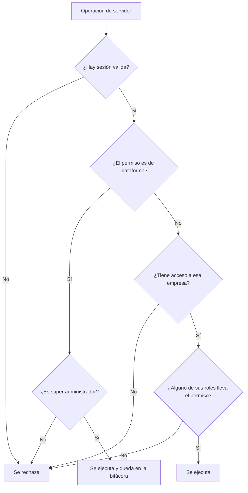

# Seguridad

**Audiencia:** desarrollo
**Estado:** vigente
**Responsable:** equipo de arquitectura
**Última revisión:** 2026-09-14

Quién puede hacer qué dentro del sistema. Al terminar sabes qué permisos existen, qué
lleva cada rol del sistema, qué se comprueba hoy en el servidor y qué reglas de acceso no
caben en una tabla.

Este documento todavía no incluye el modelo de amenazas ni el detalle del mecanismo de
autenticación. Mientras se escriben, esas dos cosas viven en los registros de decisión
[0004](../adr/0004-autenticacion-con-credenciales-propias.md),
[0007](../adr/0007-sesion-propia-sin-libreria-de-autenticacion.md) y
[0005](../adr/0005-super-administrador-de-plataforma.md).

## 1. Cómo se decide el acceso

Se deniega por defecto. Ninguna operación se ejecuta sin verificación explícita de sesión
y de permiso en el servidor, y ocultar un control en la interfaz no autoriza nada. Es el
primer principio innegociable de [las reglas de arquitectura](../../CLAUDE.md).

Un permiso tiene uno de dos alcances, y de ahí sale la puerta por la que se comprueba.

| Alcance    | Quién lo tiene                  | Cómo se concede       |
| ---------- | ------------------------------- | --------------------- |
| Plataforma | Solo el super administrador     | Con el privilegio     |
| Empresa    | Quien tiene acceso a la empresa | Por sus roles en ella |

**La rama de empresa todavía no está construida.** Hoy el servidor solo sabe comprobar
permisos de plataforma, porque todas las pantallas que existen son de administración de la
plataforma. Los roles sí se crean en cada empresa desde el alta, con los permisos de la
matriz de abajo, así que el dato está listo y lo que falta es la comprobación. Hasta que
exista, ninguna pantalla de empresa puede darse por autorizada.

## 2. Los roles del sistema

Toda empresa nace con estos cinco roles. Se copian de una plantilla en el alta de la
empresa, dentro de la misma transacción que la crea, así que no hay ventana en la que una
empresa exista sin sus roles.

| Código       | Nombre        | Para quién es                                         |
| ------------ | ------------- | ----------------------------------------------------- |
| `admin`      | Administrador | Control total dentro de la empresa                    |
| `purchasing` | Compras       | Gestiona proveedores, órdenes de compra y recepciones |
| `sales`      | Ventas        | Gestiona clientes, pedidos de venta y despachos       |
| `warehouse`  | Almacén       | Opera el movimiento físico de mercancía               |
| `viewer`     | Consulta      | Solo lectura, no puede modificar nada                 |

El rol de administrador no lleva una lista de permisos sino una marca: recibe todo permiso
de empresa, incluidos los que se añadan después. Los otros cuatro llevan lista explícita,
y un permiso nuevo no entra en ellos hasta que alguien lo decide.

Una empresa puede crear roles propios además de estos. Sus permisos los elige quien los
crea, dentro del mismo catálogo, y por eso no aparecen aquí.

Los roles se definen por empresa (RN-007). Dos empresas pueden llamar igual a dos roles
que conceden cosas distintas, porque no son el mismo registro.

## 3. Matriz de permisos de empresa

Cincuenta permisos. Las columnas son los cinco roles del sistema, en el orden de la tabla
anterior: administrador, compras, ventas, almacén y consulta.

Leyenda: `✓` lo concede, `·` no lo concede.

| Permiso                   | Adm | Com | Ven | Alm | Con |
| ------------------------- | --- | --- | --- | --- | --- |
| `organization:read`       | ✓   | ✓   | ✓   | ✓   | ✓   |
| `organization:update`     | ✓   | ·   | ·   | ·   | ·   |
| `user:read`               | ✓   | ·   | ·   | ·   | ·   |
| `user:invite`             | ✓   | ·   | ·   | ·   | ·   |
| `user:update`             | ✓   | ·   | ·   | ·   | ·   |
| `user:suspend`            | ✓   | ·   | ·   | ·   | ·   |
| `role:read`               | ✓   | ·   | ·   | ·   | ·   |
| `role:create`             | ✓   | ·   | ·   | ·   | ·   |
| `role:update`             | ✓   | ·   | ·   | ·   | ·   |
| `role:delete`             | ✓   | ·   | ·   | ·   | ·   |
| `warehouse:read`          | ✓   | ·   | ·   | ✓   | ✓   |
| `warehouse:create`        | ✓   | ·   | ·   | ·   | ·   |
| `warehouse:update`        | ✓   | ·   | ·   | ·   | ·   |
| `warehouse:archive`       | ✓   | ·   | ·   | ·   | ·   |
| `product:read`            | ✓   | ✓   | ✓   | ✓   | ✓   |
| `product:create`          | ✓   | ·   | ·   | ·   | ·   |
| `product:update`          | ✓   | ·   | ·   | ·   | ·   |
| `product:archive`         | ✓   | ·   | ·   | ·   | ·   |
| `catalog:manage`          | ✓   | ·   | ·   | ·   | ·   |
| `supplier:read`           | ✓   | ✓   | ·   | ·   | ✓   |
| `supplier:create`         | ✓   | ✓   | ·   | ·   | ·   |
| `supplier:update`         | ✓   | ✓   | ·   | ·   | ·   |
| `supplier:archive`        | ✓   | ·   | ·   | ·   | ·   |
| `customer:read`           | ✓   | ·   | ✓   | ·   | ✓   |
| `customer:create`         | ✓   | ·   | ✓   | ·   | ·   |
| `customer:update`         | ✓   | ·   | ✓   | ·   | ·   |
| `customer:archive`        | ✓   | ·   | ·   | ·   | ·   |
| `inventory:read`          | ✓   | ✓   | ✓   | ✓   | ✓   |
| `inventory:receive`       | ✓   | ✓   | ·   | ✓   | ·   |
| `inventory:issue`         | ✓   | ·   | ·   | ✓   | ·   |
| `inventory:transfer`      | ✓   | ·   | ·   | ✓   | ·   |
| `inventory:adjust`        | ✓   | ·   | ·   | ·   | ·   |
| `inventory:count`         | ✓   | ·   | ·   | ✓   | ·   |
| `lot:manage`              | ✓   | ·   | ·   | ✓   | ·   |
| `purchase_order:read`     | ✓   | ✓   | ·   | ·   | ✓   |
| `purchase_order:create`   | ✓   | ✓   | ·   | ·   | ·   |
| `purchase_order:update`   | ✓   | ✓   | ·   | ·   | ·   |
| `purchase_order:approve`  | ✓   | ·   | ·   | ·   | ·   |
| `purchase_order:cancel`   | ✓   | ·   | ·   | ·   | ·   |
| `purchase_receipt:read`   | ✓   | ✓   | ·   | ✓   | ✓   |
| `purchase_receipt:create` | ✓   | ✓   | ·   | ✓   | ·   |
| `sales_order:read`        | ✓   | ·   | ✓   | ·   | ✓   |
| `sales_order:create`      | ✓   | ·   | ✓   | ·   | ·   |
| `sales_order:update`      | ✓   | ·   | ✓   | ·   | ·   |
| `sales_order:confirm`     | ✓   | ·   | ✓   | ·   | ·   |
| `sales_order:cancel`      | ✓   | ·   | ·   | ·   | ·   |
| `sales_shipment:read`     | ✓   | ·   | ✓   | ✓   | ✓   |
| `sales_shipment:create`   | ✓   | ·   | ·   | ✓   | ·   |
| `report:read`             | ✓   | ✓   | ✓   | ·   | ✓   |
| `audit:read`              | ✓   | ·   | ·   | ·   | ·   |

Qué permite cada uno, escrito en frase y en los dos idiomas, está en el catálogo de textos
`src/lib/i18n`. Aquí va el código, que es lo que guarda la base de datos y lo que aparece
en la bitácora de auditoría.

## 4. Permisos de plataforma

Catorce permisos que solo alcanza el super administrador. No se conceden de uno en uno ni
se reparten por roles: se tiene el privilegio o no se tiene.

| Permiso                         | Qué permite                                              |
| ------------------------------- | -------------------------------------------------------- |
| `platform.organization:create`  | Crear empresas                                           |
| `platform.organization:read`    | Ver la lista de todas las empresas                       |
| `platform.organization:update`  | Editar los datos de cualquier empresa                    |
| `platform.organization:suspend` | Suspender o reactivar una empresa                        |
| `platform.organization:delete`  | Eliminar una empresa y todo lo que contiene              |
| `platform.organization:enter`   | Entrar a una empresa de la que no se es miembro          |
| `platform.user:read`            | Ver los usuarios de toda la plataforma                   |
| `platform.user:create`          | Crear cuentas de usuario                                 |
| `platform.user:update`          | Editar cualquier usuario y sus accesos a empresas        |
| `platform.user:suspend`         | Suspender o reactivar cualquier usuario                  |
| `platform.user:delete`          | Eliminar una cuenta de usuario                           |
| `platform.admin:grant`          | Conceder el privilegio de super administrador            |
| `platform.admin:revoke`         | Revocar el privilegio de super administrador             |
| `platform.audit:read`           | Consultar la bitácora de auditoría de toda la plataforma |

## 5. Lo que la matriz no dice

Una tabla de permisos describe lo que se puede hacer, no en qué condiciones. Estas reglas
mandan por encima de ella.

- **El super administrador entra a una empresa eligiéndola de forma explícita, cada vez**
  (RN-004). No queda dentro de una empresa por defecto ni arrastra la anterior.
- **Todo lo que hace el super administrador dentro de una empresa queda registrado**, con
  la empresa afectada y la marca de privilegio elevado (RN-072). Sus consultas también
  (RN-073).
- **El segundo factor es obligatorio para el super administrador y para los
  administradores de empresa** (RN-005), y hoy está suspendido de forma declarada porque
  sus pantallas de alta y verificación no existen. Se gobierna con la variable de entorno
  `PLATFORM_ADMIN_TWO_FACTOR`, que por omisión lo exige. Ver la enmienda del
  [ADR 0005](../adr/0005-super-administrador-de-plataforma.md).
- **Suspender a un usuario o retirarle el acceso corta su sesión de inmediato**, no al
  expirar (RN-006).
- **Un usuario puede quedar limitado a ciertos almacenes dentro de su empresa** (RN-008).
  Es una regla supuesta, todavía sin confirmar y sin implementar. Cuando entre, la matriz
  dejará de ser suficiente por sí sola.

El catálogo completo y el estado de cada regla están en
[reglas de negocio](reglas-de-negocio.md).

## 6. Dónde vive la verdad y cómo se mantiene esta tabla

El catálogo de permisos y las plantillas de rol son código: `src/lib/auth/permissions.ts`.
Esa es la única fuente. Esta matriz se deriva de ahí, y una prueba unitaria la compara con
el catálogo en cada ejecución de la verificación.

Por eso no hace falta recordar actualizar este documento: si alguien añade un permiso,
cambia un rol o corrige una descripción y no toca esta tabla, la verificación falla y dice
qué fila sobra o cuál falta. Son dos pruebas en `tests/unit`: una compara esta tabla con
el catálogo, y otra vigila que ningún permiso llegue a la pantalla sin traducir.

## 7. Bitácora de auditoría

Cumple RN-070 a RN-073. El catálogo de acciones es código, `AUDIT_ACTIONS` en
`src/modules/audit/types.ts`, y es la única fuente: aquí se describe el criterio, no la
lista.

**Qué se registra.** Toda escritura sobre empresas, cuentas, accesos a empresa y privilegio
de plataforma, además de tres sucesos de sesión: entrar, cambiar la contraseña y quedar
bloqueado por intentos fallidos. Cada entrada se escribe en la misma transacción que el
cambio: si el cambio se revierte, la entrada también, y si la entrada no se puede escribir,
el cambio no ocurre.

**Qué guarda cada entrada.**

| Dato                         | Para qué                                                            |
| ---------------------------- | ------------------------------------------------------------------- |
| Acción                       | El hecho de negocio, con la forma `dominio.hecho`                   |
| Autor                        | Quien operó. Vacío solo en el bloqueo por intentos, que no tiene    |
| Empresa afectada             | La del registro tocado, no la de la sesión. Vacía si no hay empresa |
| Privilegio elevado           | Permiso de plataforma o super administrador en empresa ajena        |
| Permiso ejercido             | El que autorizó esa entrada concreta                                |
| Entidad y etiqueta           | Qué se tocó, y cómo se llamaba en ese momento                       |
| Antes y después              | Solo los campos que cambiaron, nunca la fila entera                 |
| Red, navegador y correlación | De dónde vino, y qué entradas salieron de la misma operación        |

**Qué no entra.**

- Contraseñas, huellas, testigos ni secretos. El servicio de auditoría rechaza la operación
  entera si un campo se llama así, en lugar de enmascararlo: en una tabla de solo inserción
  no hay forma de limpiarlo después.
- Los intentos de entrar fallidos y los accesos denegados. No tienen a quién atribuirse y
  van al registro de la aplicación, que ya enmascara lo sensible.
- Las consultas del super administrador dentro de una empresa (RN-073). Se registrarán
  cuando exista la acción de entrar a una empresa, que todavía no está construida.
- La purga por antigüedad. El plazo de retención (RN-074) está pendiente de negocio y hasta
  entonces no se borra nada.

**Cómo se protege.** Un disparador de la base rechaza cualquier `UPDATE`, `DELETE` o
`TRUNCATE` sobre `audit_logs` (RN-071). Hoy la aplicación y las migraciones comparten el
rol de base de datos, así que el dueño de la tabla podría desactivar ese disparador. La
protección completa llega con un rol propio para la aplicación que solo tenga `SELECT` e
`INSERT` sobre la bitácora.
