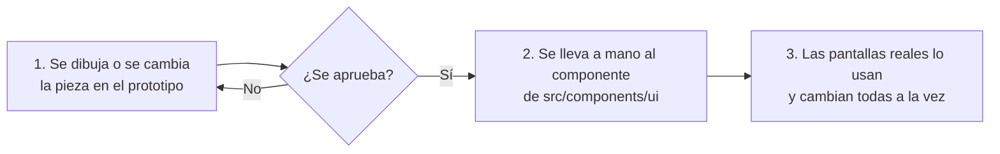

# Prototipo y componentes compartidos

**Audiencia:** desarrollo
**Estado:** vigente
**Responsable:** equipo de frontend
**Última revisión:** 2026-09-28

Este documento explica por qué el prototipo vive separado de la aplicación real, cómo
viaja un cambio de diseño desde el boceto hasta las pantallas en uso, y qué reglas impide
romper el linter.

## 1. Dos árboles con papeles distintos

| Árbol                               | Qué es                                | Quién lo consume                    |
| ----------------------------------- | ------------------------------------- | ----------------------------------- |
| `src/app/prototype/`                | Boceto navegable con datos falsos     | Nadie. Se borra cuando sobra        |
| `src/components/ui/`                | Piezas visuales sin lógica de negocio | Las pantallas reales                |
| `src/modules/<dominio>/components/` | Interfaz propia de un dominio         | Las rutas de ese dominio            |
| `src/app/catalog/`                  | Escaparate de `src/components/ui`     | Desarrollo. No existe en producción |

El prototipo existe para decidir el diseño con algo que se puede tocar, no para adelantar
código. Por eso puede romperse, contradecirse o probar tres versiones de la misma
pantalla a la vez.

## 2. El prototipo no comparte componentes

**El prototipo no importa nada de `src/components` ni de `src/modules`.** Tiene sus
propias copias en `src/app/prototype/ui/`, y esa duplicación es deliberada.

La razón es que un boceto que comparte piezas con producción deja de ser un boceto:
cualquier prueba de diseño cambiaría al instante pantallas que ya están en uso, y nadie
se atrevería a probar nada. El precio de la independencia es mantener dos copias; el
precio de compartir sería no poder experimentar.

En el sentido contrario la regla es igual de estricta: ninguna pantalla real importa del
prototipo, porque el prototipo se borra.

Lo que sí comparten los dos árboles son los textos (`src/lib/i18n`) y los formatos
(`src/lib/format`). No son diseño: son contenido, y tenerlos por duplicado haría que el
boceto enseñara palabras que el sistema no dice.

## 3. El orden es obligatorio: prototipo, componente, aplicación

**Ninguna pieza visual entra en la aplicación real antes de existir en el prototipo y
antes de existir como componente compartido.** Son tres pasos y siempre van en este orden,
sin excepción y sin atajos.

1. **Primero el prototipo.** Es donde se discute el diseño y donde equivocarse es barato.
   Si la pieza todavía no existe, se dibuja aquí, en `src/app/prototype/ui/`, y se usa en
   la pantalla del prototipo que la necesita. Si ya existe pero está escrita a mano en
   varios sitios, se factoriza aquí primero.
2. **Después el componente compartido.** Se lleva a `src/components/ui/` con la misma
   forma, un solo archivo. Es el paso donde la pieza pasa de boceto a pieza de producción:
   recibe sus datos por propiedad y deja de saber de dónde vienen.
3. **Al final la aplicación.** Las pantallas reales lo usan. Si alguna no cambió, es que
   dibujaba la pieza por su cuenta, y ese es el defecto que hay que arreglar.

Portar no es copiar y pegar. El prototipo usa datos inventados y almacenes en memoria; el
componente real recibe sus datos por propiedad, valida con Zod y no sabe de dónde vienen.
Lo que se porta es la forma, nunca el relleno.

### Por qué en ese orden y no en otro

Empezar por la aplicación parece más rápido y cuesta el doble. Una pieza escrita
directamente en una pantalla real nace atada a los datos de ese dominio, así que cuando la
segunda pantalla la necesita hay que desatarla, y mientras tanto ya hay dos copias
divergiendo. Y el diseño acaba discutiéndose sobre código en producción, que es el sitio
más caro para cambiar de opinión.

### Lo que queda fuera del orden

Estos cambios no pasan por el prototipo, porque no son decisiones de diseño:

- Un arreglo de un fallo funcional en una pantalla real. Eso no es diseño.
- Un cambio que no se ve: renombrar, mover, tipar, cubrir con pruebas.
- Una pieza que no es visual: un esquema, un servicio, un repositorio.

Lo que sí pasa por el orden, aunque parezca menor: cualquier cambio de aspecto, por pequeño
que sea, incluido mover una pieza de sitio en la pantalla o cambiarle un color.

## 4. Qué es un componente compartido

Va a `src/components/ui/` lo que cumple las tres cosas:

- No conoce ningún dominio. Una tabla no sabe qué es una empresa.
- Recibe todo por propiedad. No llama a Prisma, ni a una Server Action, ni lee la sesión.
- Lo usa, o lo va a usar, más de una pantalla.

Si una pieza solo sirve a un dominio, vive en `src/modules/<dominio>/components/`. Si es
lógica y no dibujo, vive en `src/lib/`.

Cuando la misma marca visual aparece escrita a mano en dos archivos, no es que haya dos
pantallas parecidas: es que falta un componente.

## 5. Lo que impide el linter

Las dos direcciones están cerradas con `no-restricted-imports` en `eslint.config.mjs`, así
que romper la regla falla en la verificación y no en revisión:

- Un archivo del prototipo que importe de `@/components` o `@/modules`.
- Un archivo de la aplicación real que importe del prototipo.

## 6. Cuando el prototipo deja de hacer falta

Una pantalla ya construida de verdad no necesita su boceto. Se borra la carpeta del
prototipo correspondiente y con ella su copia de la interfaz. El prototipo no se
mantiene al día por respeto: se mantiene mientras sirva para decidir algo.

## 7. El catálogo de componentes

`/catalog` enseña los componentes reales de `src/components/ui`, uno por página, con datos
inventados y en todos sus estados: normal, con error, deshabilitado, vacío, con texto
largo. Tiene a mano el conmutador de tema y el de idioma. Responde `404` en producción y
en las vistas previas de Vercel.
[ADR 0019](../adr/0019-catalogo-de-componentes-fuera-de-produccion.md).

No es un paso más del orden de la sección 3. El diseño se decide en el prototipo; el
catálogo solo enseña lo que salió del paso 2. Si una variante se prueba primero en el
catálogo, se está saltando el prototipo.

Reglas:

- Importa solo de `@/components/ui` y de `@/lib`. Nada de `@/modules`, Prisma, Server
  Actions ni sesión: si una pieza los necesita para verse, no es un componente compartido.
- Todo archivo nuevo de `src/components/ui` llega con su página. Una prueba unitaria
  (`tests/unit/catalog/catalog-coverage.test.ts`) recorre la carpeta y falla si un archivo
  no está en `src/app/catalog/entries.ts`: en el catálogo, en la lista de pendientes o en
  la de archivos que no dibujan nada.
- La lista de pendientes solo encoge. Llevar un componente al catálogo es borrarlo de ella
  y añadir su entrada y su carpeta.
- Si cambia la forma de un componente, su página cambia en la misma propuesta de cambio.
- Los textos del propio catálogo van en español y no pasan por `src/lib/i18n`, porque es
  una herramienta de desarrollo. Los de los componentes sí, porque el idioma es parte de
  lo que se revisa.

Para añadir un componente: una entrada en `CATALOG_ENTRIES`, una carpeta
`src/app/catalog/<slug>/page.tsx` que use `CatalogHeader` y `Specimen`, y, si el
componente necesita estado, un archivo de cliente junto a la página que lo guarde.
